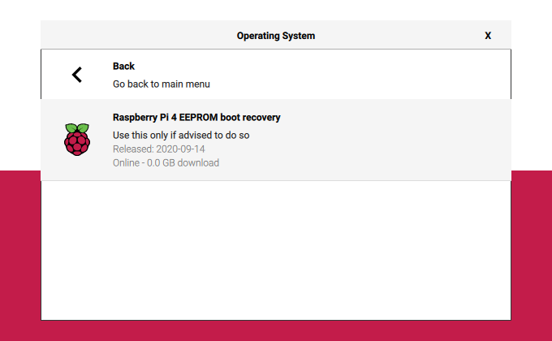

# Part I: Download & Flash image

### Flash Image

Download, install & open [Raspberry Pi Imager](https://github.com/raspberrypi/rpi-imager/releases/latest). Plug in your target USB drive.



```text
# Ubuntu users can download and install with snapd
sudo apt update
sudo apt install snapd
sudo snap install rpi-imager
```




Older models of the Pi4B 8GB need to have their boot loader updated to boot from USB. If your image won't boot remove the USB3 drive and use rpi-imager to flash Pi 4 EEPROM boot recovery to an sd card.

Plug the Pi into a monitor, insert the sd card and power up. Once you see a green screen you should be good to boot from your USB3 drive. Newer versions are shipping with a USB boot capable boot loader. **Feeling lucky?**

**Choose OS -&gt; Misc utility images -&gt; Raspberry Pi 4 EEPROM boot recovery** [https://www.raspberrypi.org/documentation/hardware/raspberrypi/booteeprom.md](https://www.raspberrypi.org/documentation/hardware/raspberrypi/booteeprom.md) 






### Obtain Pi-Pool.img.gz files by clicking the link "PI-Node" and download [Pi-Node](https://db.adamantium.online/Pi-Node.img.gz) 


**The following steps are all done within the Raspberry Pi imager**


* [ ] **Choose OS -&gt; Use custom**
* [ ] **Locate the .img.gz file you downloaded & wish to flash.**
* [ ] Locate your target drive & write it to disk.








[Pi-Node](https://db.adamantium.online/Pi-Node.img.gz)

| Pi-Relay | Pi-Core | Pi-Cold |
| :--- | :--- | :--- |


#### Within Raspberry Pi Imager

**Choose OS -&gt; Use custom**

Locate the .img.gz file you downloaded & wish to flash.

Locate your target drive & write it to disk.

 



#### Within Raspberry Pi Imager

#### Select Ubuntu Server 20.10 \(RPI 3/4/400\)

**Choose OS -&gt; Other general purpose OS -&gt; Ubuntu -&gt; Ubuntu Server 20.10 \(RPI 3/4/400\)**. The 64 bit option.

Locate your target drive & write it to disk.

  

